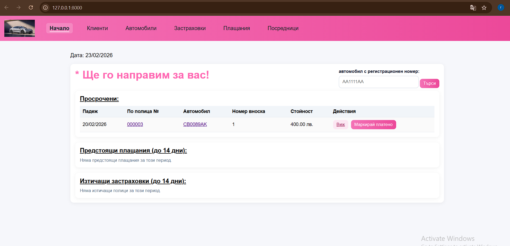
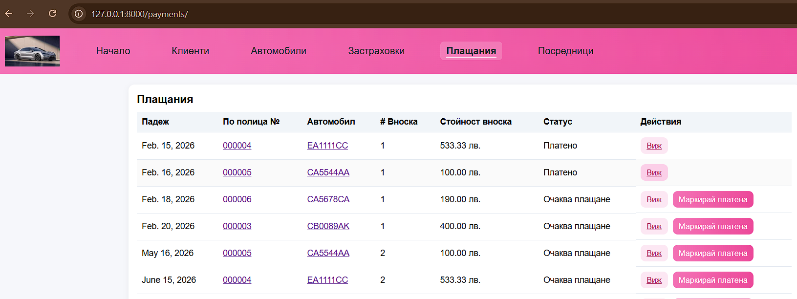

# 🛡️ ErmaIns – Insurance Management System

ErmaIns е уеб приложение за застрахователни компании, предназначено за управление на клиенти, автомобили, застраховки, плащания и посредници .

Проектът демонстрира работа с релационни модели, Many-to-Many връзки, form валидации, custom template логика и структурирана Django архитектура.

---

## 🚀 Основни функционалности

-  Създаване и проследяване на застраховки
-  CRUD управление на клиенти  
-  Управление на автомобили  
-  Проследяване на плащания  
-  Управление на посредници  
-  Many-to-Many връзка между клиенти и посредници  
-  Валидации (уникално ЕГН, активен посредник и др.)  
-  Custom UI 
-  Custom 404 страница  

---

## 🏗️ Архитектура

Проектът е разделен на отделни Django приложения:

- customers/
- vehicles/
- insurance/
- payments/
- intermediaries/

---

## 🔗 Връзки между моделите:

- Един клиент може да има повече от един посредник (ManyToMany)
- Един автомобил принадлежи на конкретен клиент
- Застраховката е свързана с автомобил
- Плащанията са свързани със застраховка

---

## 🧠 Бизнес логика
- Всеки посредник може да добавя/редактира/изтрива клиенти, автомобили и застраховки
- Един клиент може да има повече от един посредник, но поне един активен 
- Към един автомобил може да се добавят различни по вид застраховки
- Застраховките може да се разсрочват; падежите,вноските и крайна дата се изчисляват автоматично
- Валидират са дати, ЕГН и телефонен номер и др.
- Защита от дублиране на номер на полица при едновременни записи

---

## ⚙️ Технологии

- Python 3.10+
- Django 5.2+
- HTML + Custom CSS
- Django ORM

---

## 📌 Бъдещи подобрения

- Автоматично известяване за изтичащи полици
- PDF генерация на полица
- Потребителска автентикация и роли
- Комисионна за посредниците
- Dashboard с графики
- REST API 

## 📸 Screenshots

